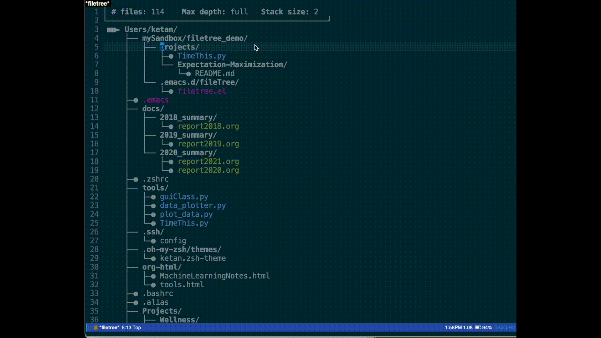
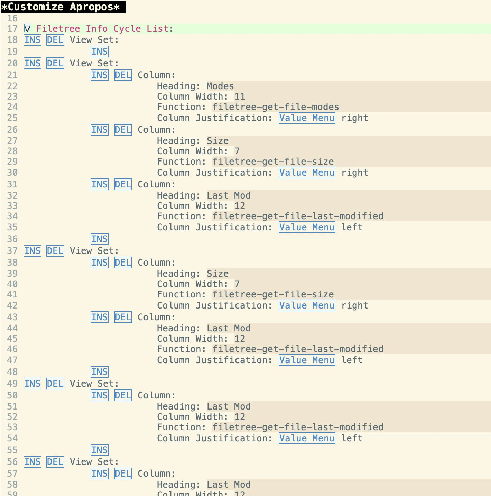

# Filetree
Filetree is a package that provides two basic functions:

* **File tree viewer**
The viewer displays a file list as a directory tree in a special buffer.  The file list can be populated from any list of files.  There are functions to populate from a number of common sources: recentf, files in buffer-list, files in the current directory, and files found recursively in the current directory.  Within the viewer, the file list can be filtered and expanded in various ways and operations can be performed on the filtered file list (e.g., grep over files in list, open file, etc.).  Multiple file lists can be saved and retrieved between sessions.

* **File notes**
The file notes enable the user to write and display (org-mode) notes associated with individual files and directories.  The note can be displayed in a side buffer either when cycling through files in the file tree viewer or when the file is open in a buffer.  The notes are kept either in a single org-mode file with a heading for each file/directory, and/or in local project specfic org-mode files.


## Demo Video
A video demoing some of the primary functionality is on [Youtube here](https://youtu.be/-KrMaLq8Bms).  The corresponding notes are in this repo [demo_notes.org](demo_notes.org).

Here are links to sections of the video that cover specific topics.

| Link to video section                                                   | Comment                                                                           |
|-------------------------------------------------------------------------|-----------------------------------------------------------------------------------|
| [Recentf wrapper](https://youtu.be/-KrMaLq8Bms?t=195)                   | This was the motivating use case for the package.                                 |
| [Filtering and expanding file list](https://youtu.be/-KrMaLq8Bms?t=395) | This section covers some of the core functionality for file tree.                 |
| [Other file lists](https://youtu.be/-KrMaLq8Bms?t=938)                  | Covers other ways to populate the file list (e.g., current dir, current buffers). |
| [Grep within files](https://youtu.be/-KrMaLq8Bms?t=1111)                | Covers the search use case.                                                       |
| [File Notes](https://youtu.be/-KrMaLq8Bms?t=1181)                       | Covers the file notes functionality.                                              |

## File tree Viewer

### Starting and Exit Viewer + Navigation & selection
The following commands start the viewer with the corresponding file list
| Command                           | Comment                                       |
|-----------------------------------|-----------------------------------------------|
| filetree-select-file-list         | select file list from perviously saved lists  |
| filetree-show-recentf-files       | populate files from recentf-list              |
| filetree-show-cur-dir             | populate files from current dir               |
| filetree-show-cur-dir-recursively | populate files from current dir (recursively) | 
| filetree-show-cur-buffers         | populate files from buffer-list               |
| filetree-show-files-with-notes    | populate file list with files with "notes"    |
| filetree-show-files               | populate files from file list in argument     |
| filetree-close-session            | exit viewer (tied to q in keymap)             |


Within the *Filetree* window the following navigation commands can be used
| Command              | key map          | Comment         |
|----------------------|------------------|-----------------|
| filetree-next-line   | down, j          | down one line   |
| filetree-prev-line   | up, k            | up one line     |
| filetree-next-branch | SPC              | down one branch |
| filetree-prev-branch | TAB              | up one branch   |
| --                   | RETURN (on file) | open file       |

### View modes


| Command                           | key map | Comment                                    |
|-----------------------------------|---------|--------------------------------------------|
| filetree-set-max-depth            | 0-9     | set max depth of tree to view 0=max        |
| filetree-cycle-max-depth          | <none>  | cycle through max depth                    |
| filetree-toggle-combine-dir-names | /       | toggle combining dir/subdirs in dir name   |
| filetree-toggle-use-all-icons     | ;       | toggle use-all-icons icons (if installed)  |
|                                   | ]       | cycle right through info views on the left |
|                                   | [       | cycle left through info views on the left  |

### Filtering and Expanding
There are a number of ways to filter down the file list or to add files to the file list.  The results after each filtering or expansion operations is put on a stack and can be undone by popping off the stack using the "b" key.

| Command                             | key map | Comment                                                                     |
|-------------------------------------|---------|-----------------------------------------------------------------------------|
| filetree-pop-file-list-stack        | b       | undo prev filter/expansion operation                                        |

#### Regex-based filtering/expansion and narrowing to subdir


| Command                         | key map | Comment                                     |
|---------------------------------|---------|---------------------------------------------|
| filetree-filter                 | f       | Regex based filter                          |
| filetree-expand-dir             | e       | Add files in directory at point             |
| filetree-expand-dir-recursively | E       | Add files in directory at point recursively |
| --                              | RET     | Return on subdir, narrows to that subdir    |

Notes:
* The filetree-toggle-combined-dir-names command (see in View mode section below) can be helpful when wanted to use filetree-expand (or filetree-expand-dir-recursively) on a directory one or more levels above a file in the file list.

#### Helm-based filtering
| Command                             | key map | Comment                                                                     |
|-------------------------------------|---------|-----------------------------------------------------------------------------|
| filetree-helm-filter                | s       | helm-based search                                                           |

#### Stack operations
| Command                             | key map | Comment                                                                     |
|-------------------------------------|---------|-----------------------------------------------------------------------------|
| filetree-diff-with-file-list-stack  | -       | remove files in current file-list from list on stack and make new file-list |
| filetree-union-with-file-list-stack | +       | combine files in current file-list and list on stack into new file-list     |

Notes:
* The filetree-diff-with-file-list-stack command can be helpful for doing "complementary" filters, e.g., filtering for all files with test and then issuing the command will have the effect of removing all the files with test.

#### Marking files and filtering based on marks


| Command                             | key map | Comment                                                                     |
|-------------------------------------|---------|-----------------------------------------------------------------------------|
| filetree-mark-item                  | m       | toggle mark on file or add mark to all files in file-list in subdir         |
| filetree-clear-marks                | c       | clear marks                                                                 |
| filetree-select-marked-items        | M       | make file-list all marked files                                             |

Marks on files are not affected by the filtering operations, so you can use the filtering tools to track down each of the files you're interested in one by one.

### Operations
| Command       | key map | Comment                                         |
|---------------|---------|-------------------------------------------------|
| filetree-grep | g       | grep over files in current list                 |
| dired         | d       | opens a dired session at the directory at point |

### Save/Retrieve file list
File lists can be saved/retrieved from the file specified by filetree-saved-lists-file.  The filetree-select-file-list function uses a helm interface for selection of the file list.
| Command                   | key map | Comment                                |
|---------------------------|---------|----------------------------------------|
| filetree-select-file-list | L       | load/select previously saved file list |
| filetree-save-list        | S       | save current file list                 |
| filetree-delete-list      | D       | delete file list                       |

## File Notes
This package maintains a notes file in the file specified by filetree-notes-file (default: ~/.emacs.d/filetree-notes.org).  This is an org-mode file that can hold notes associated with any file, and those notes can be seen in a side window as the user navigates through the file tree.  

Local project specific notes files can also be used--simply create an empty file in the project directory with the name "filetree-notes-local.org" (or whatever name is set by the variable filetree-relative-notes-filename).  Files under this directory will use this file for notes instead of the main file.  The file links in the local file will be relative to the project directory.  The main org-mode file will still be used for files without a local org-mode file.

In order to go to the entry for a file (and create an entry if it doesn't exist), use the filetree-toggle-info-buffer command.  For example, you can use the following key binding in your .emacs to run the command:
```
(global-set-key (kbd "C-c <return>") (lambda ()
                                       "Toggle filetree-info-buffer and switch to it if active"
                                       (interactive)
                                       (filetree-toggle-info-buffer t)))
```
The same command will open and close (after saving) the notes buffer in the side window.

Within the filetree buffer, the "i" key will toggle the side window with the notes file.  The notes will dynamically narrow to the relevant part of the file as the user navigates the file tree and will also switch to/from the local org-mode file if applicable.  If there is no note entry for the file, then the message "No File Note Entry" will be shown in the side window.
| Command                         | key map | Comment                                     |
|---------------------------------|---------|---------------------------------------------|
| filetree-toggle-info-buffer     | i       | Toggle info buffer in side window           |
|                                 | I       | ^^ and then switch to side window if active |

## Customizations

### Files used by filetree
| Parameter                        | default                            | Comment                                        |
|----------------------------------|------------------------------------|------------------------------------------------|
| filetree-notes-file              | ~/.emacs.d/filetree-notes.org      | File used for file notes                       |
| filetree-relative-notes-filename | "filetree-notes-local.org"         | Filename used for project specific notes files |
| filetree-saved-lists-file        | ~/.emacs.d/filetree-saved-lists.el | File used for saved file lists                 |

### Settings related to startup state
| Parameter                  | default  | Comment                                          |
|----------------------------|----------|--------------------------------------------------|
| filetree-info-window       | nil      | Set to t to show notes/info side window at start |
| filetree-use-all-the-icons | nil      | Set to t to show icons for files/dirs            |

Note enabling use-all-the-icons can make some of the operations sluggish if the file list is large.  Also, you may need to set the scaling for the icons to match the height of the text:
```
(setq all-the-icons-scale-factor 1)
```
### Additional file info configuration
The additional columns of information that can be shown on the left of the filetree are configurable.  Use M-x customize on the variable filetree-info-cycle-list for this configuration.  The screenshot below shows an example configuration.  

The sets of columns that are cycled through using "]" and "[" are called a view set.  Each view set has a set of columns and each column is specified by the column heading, the width of the column, the column justification (i.e., left/right/center), and a function that takes a filename/dirname as input and returns a string of information to display.  By writing your own functions (similar to functions like filetree-get-file-last-modified) and adding an entry with that function to filetree-info-cycle-list, you can show whatever information about a file you'd like on the left.



### Faces, marks, and misc
The variable filetree-exclude-list is a list of regex for files to ignore.

The marks used to draw the file trees can be customized.  Here is the list of symbols that are used:
filetree-symb-for-root filetree-symb-for-box, filetree-symb-for-vertical-pipe, filetree-symb-for-horizontal-pipe, filetree-symb-for-left-elbow, filetree-symb-for-right-elbow, filetree-symb-for-branch-and-cont, filetree-symb-for-file-node.

The faces used for different file types as well as the shortcuts used to filter those file types are specified using 'filetree-add-filetype.  The function that sets the default settings can be used as an example (see below).  The calls to filetree-add-filetype has the following arguments: file type name, shortcut, regex, face.  Note (setq filetree-filetype-list nil) clears any previous filetype entries in filetree-filetype-list.
```
(defun filetree-configure-default-filetypes ()
  "Define default `filetree-filetype-list'.
This defines filetype faces, filetype regex, and filter shortcuts.
This function is given as an example.  The user can generate their own
custom function with calls to `filetree-add-filetype'"
  (interactive)
  (setq filetree-filetype-list nil)
  (filetree-add-filetype "No Filter" 0   ""        ())
  (filetree-add-filetype "Python"    ?p  "\.py$"   '(:foreground "steel blue"))
  (filetree-add-filetype "Org-mode"  ?o  "\.org$"  '(:foreground "DarkOliveGreen4"))
  (filetree-add-filetype "elisp"     ?e  "\\(?:\\.e\\(?:l\\|macs\\)\\)"  '(:foreground "purple"))
  (filetree-add-filetype "C"         ?c  "\\(?:\\.[ch]$\\|\\.cpp\\)"     '(:foreground "navyblue"))
  (filetree-add-filetype "PDF"       ?d  "\.pdf$"  '(:foreground "maroon"))
  (filetree-add-filetype "Matlab"    ?m  "\.m$"    '(:foreground "orange"))
  (filetree-add-filetype "Text"      ?t  "\.txt$"  '(:foreground "gray50")))
```
The default face is specified by filetree-default-file-face.
