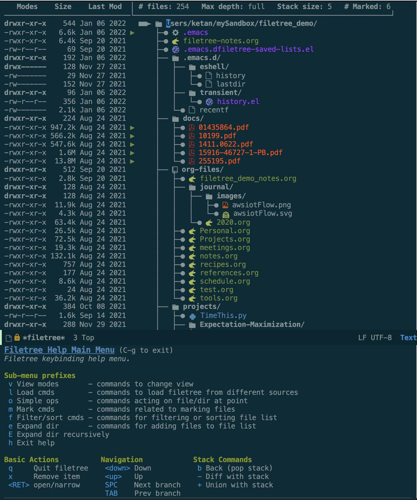
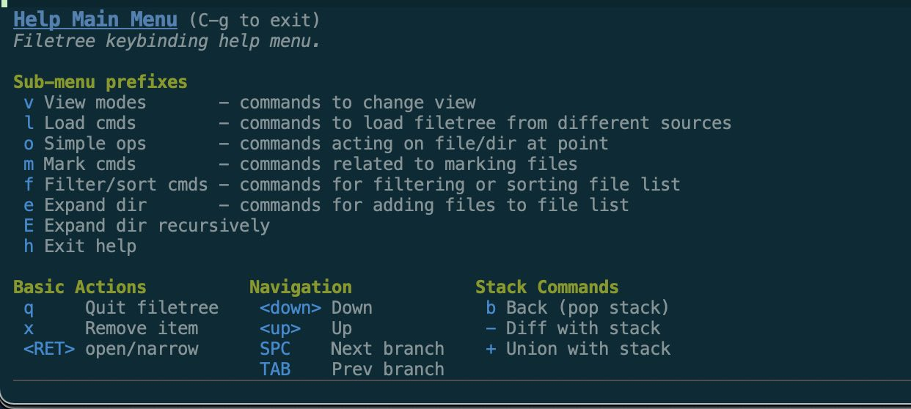
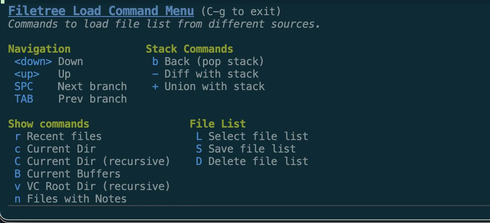
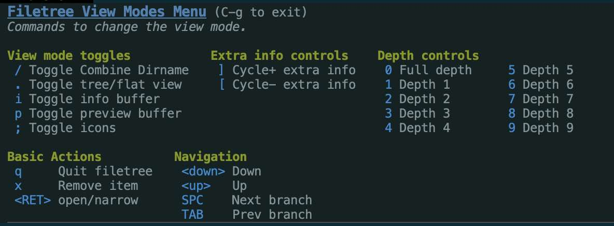
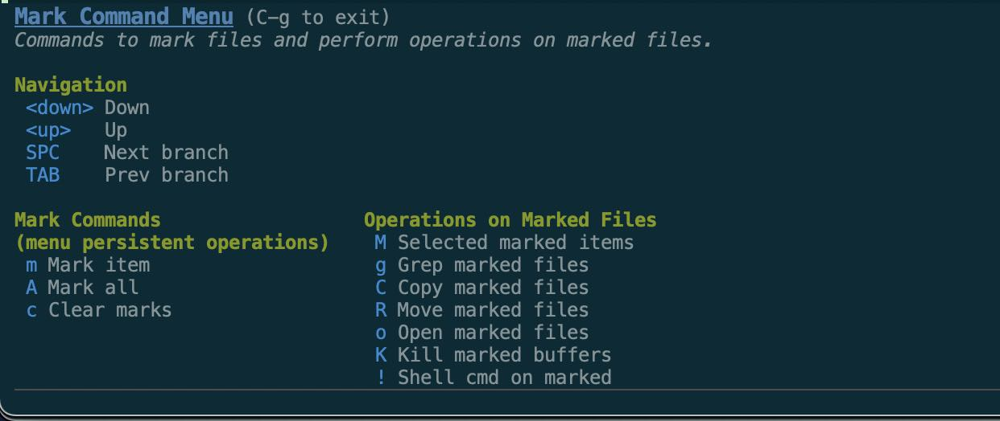
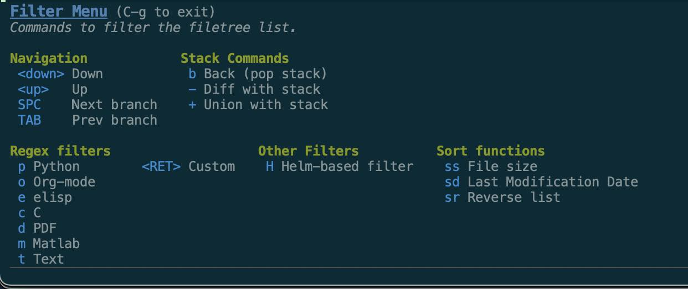
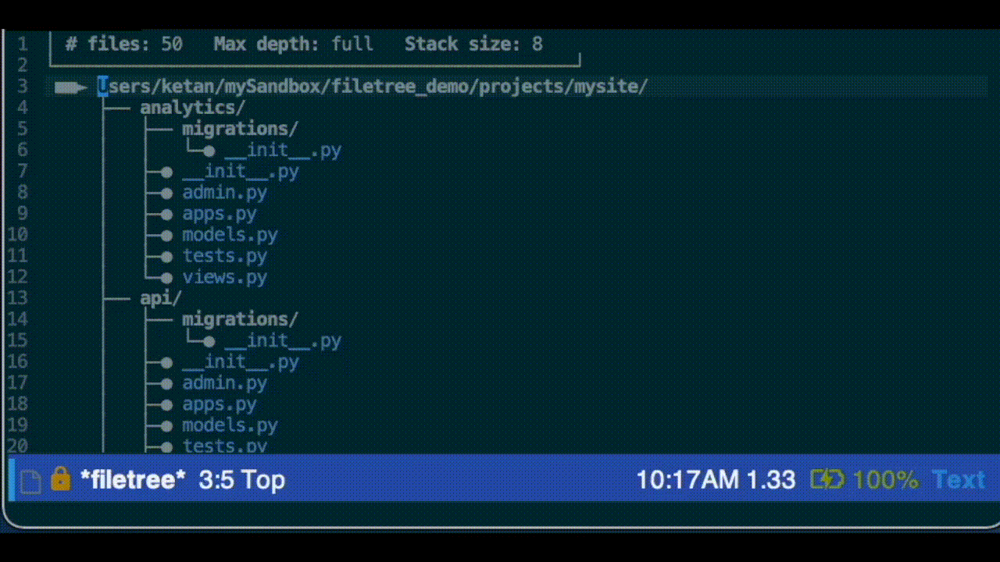
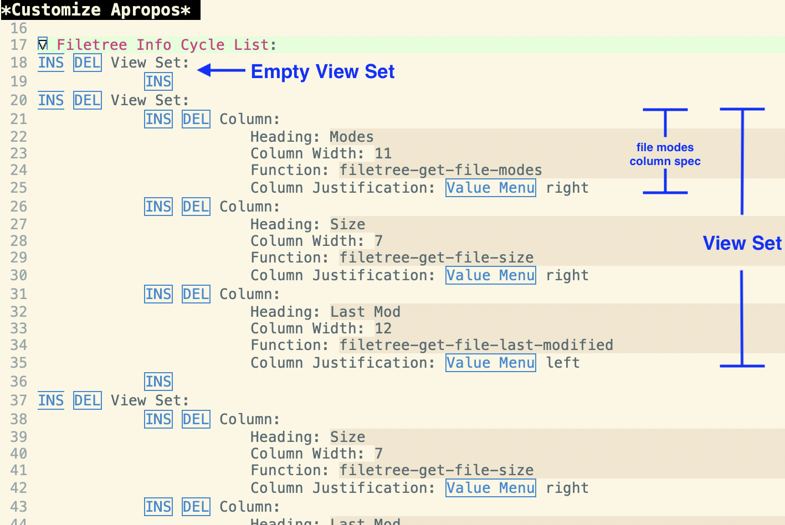

# Filetree

Filetree is a package that provides two basic functions:

* **File tree viewer**
The viewer displays a file list as a directory tree in a special buffer.  The file list can be populated from any list of files.  There are functions to populate from a number of common sources: recentf, files in buffer-list, files in the current directory, and files found recursively in the current directory.  Within the viewer, the file list can be filtered, marked, and expanded in various ways and operations can be performed on the filtered file list (e.g., grep over files in list, open files in buffers, move files, copy files, run script on files, etc.).  Multiple file lists can be saved and retrieved between sessions.

* **File notes**
The file notes enable the user to write and display (org-mode) notes associated with individual files and directories.  The note can be displayed in a side buffer either when cycling through files in the file tree viewer or when the file is open in a buffer.  The notes are kept either in a single org-mode file with a heading for each file/directory, and/or in local project specific org-mode files.



# Getting Started
Filetree is available on [MELPA](http://melpa.org/), and can be installed with package-install after MELPA is added to package-archives.

Filetree now uses [transient](https://github.com/magit/transient) based hierarchical key bindings in order to both improve key binding scalability and organization, as well as to better facilitate feature discovery.   The command filetree-command-help will pull up the "Help Main Menu" transient (also available with the "h" key binding when in the filetree buffer).  The key bindings for filetree commands can be found from this help window.

Pressing "l" from this menu (filetree-load-cmd-menu) will bring up a menu of sources for the filetree (e.g., recent files, files in current directory, current buffers, etc.).

# Demo Video
A video demoing some of the primary functionality is on [Youtube here](https://youtu.be/-KrMaLq8Bms).  The corresponding notes are in this repo [demo_notes.org](demo_notes.org).  Note that this demo video is a bit out-of-date now, but does give an overview of some basic usages for the package.

Here are links to sections of the video that cover specific topics.

| Link to video section                                                   | Comment                                                                           |
|-------------------------------------------------------------------------|-----------------------------------------------------------------------------------|
| [Recentf wrapper](https://youtu.be/-KrMaLq8Bms?t=195)                   | This was the motivating use case for the package.                                 |
| [Filtering and expanding file list](https://youtu.be/-KrMaLq8Bms?t=395) | This section covers some of the core functionality for file tree.                 |
| [Other file lists](https://youtu.be/-KrMaLq8Bms?t=938)                  | Covers other ways to populate the file list (e.g., current dir, current buffers). |
| [Grep within files](https://youtu.be/-KrMaLq8Bms?t=1111)                | Covers the search use case.                                                       |
| [File Notes](https://youtu.be/-KrMaLq8Bms?t=1181)                       | Covers the file notes functionality.                                              |

# Use Cases and Alternatives 
The filetree package provides a set of interactive tools for finding and discovering files and information about files:
* **Visual contextualization** - directory structure, faces for file types, icons, file info (mode, size, date, etc.), file notes in side window
* **Interactive filtering tools** - filter by type, regex, helm-based interactive filtering, file marking, etc.
* **File discovery** - tools for finding new files from original file list
* **Actions on files** - tools for acting on files in file list (e.g., grep, move/copy/delete files, shell command on files)
* **Notes** - support for file specific org-mode notes

These tools can be used in a number of different ways.  Some possible use cases along with alternatives are discussed below.

## Recent files use case
The filetree package can be used as a wrapper for the built-in recentf command.  The command for using the wrapper is filetree-showRecentfFiles.  Compared with the basic recentf command, the filetree command provides better visual context for the recent files, and a host of tools for filtering the recent file list or finding other files that are located around a recently accessed file.  This enables users to use recent files in a more expansive way.  Users may want to increase the number of files saved from default of 20 to something higher using the following setting:
```
(setq recentf-max-saved-items 500)
```
Alternative wrappers for recentf (e.g., the [helm](https://emacs-helm.github.io/helm/) command helm-recentf), provide some filtering tools for recentf, but not the other features available in the filetree package.

## Current buffers use case
This package can be used as an alternative to ibuffer in some cases, using the command filetree-show-cur-buffers.  The command provides the same benefits over ibuffer as the recentf wrapper does over recentf in the previous section.

While ibuffer represents all buffers, filetree-show-cur-buffers represents files not buffers.  As a result it does not represent buffers that are not associated with files (e.g., \*Messages\* or \*scratch\*).  Another difference is that ibuffer provides some buffer grouping tools.  In filetree there are implicit groupings via the directory structure, or via filtering or font highlighting rules, but no explicit grouping.

[bufler](https://github.com/alphapapa/bufler.el) is an alternative that provides some additional automatic buffer grouping support over ibuffer.  The differences between bufler and filetree are the same as the differences between ibuffer and filetree.

## File/Project explorer use case
The filetree package can be used as a file or project explorer, using filetree-show-cur-dir or filetree-show-cur-dir-recursively or by saving/loading a file list for a project.

There are many other alternative tree-based file/project explorers (e.g., [treemacs](https://github.com/Alexander-Miller/treemacs), [neotree](https://github.com/jaypei/emacs-neotree)).  For the use case of having a (persistent) project directory/file tree displayed in a side window, these other packages are preferable over filetree.  For example, treemacs can be configured to automatically update the tree when there are changes in the file system, it has projectile and git integration, etc..  

The project/file explorer use case for filetree is different, and comes from a couple of fundamental differences between filetree and these other file/project explorers:
* First, filetree starts with the implicit assumption that some files are more important to the user than others (e.g., recent files, files currently opened in a buffer, files in the current directory, a previously saved file list)--only those files are initially displayed in the tree, and others are found through discovery (via expansion tools).
* Secondly, there's an emphasis on interactive tools for project/file exploration--there are a lot of interactive tools available in filetree to navigate, filter, and discover files.

In a typical filetree use case, the filetree is pulled up for an action (e.g., finding a file, searching for something in the files in a project, visualizing the directory structure), the interactive tools are used to find the desired information or file and then filetree is closed.  This is different from how a conventional project/file explorer is typically used.

## Dired use case
The filetree package can do some basic file system operations that are akin to operations available in dired.  In particular, the user can filter, expand, and mark files--and then perform operations like delete files, copy/move files, run script on files, grep across the marked files, etc..  Dired can run a more extensive set of file system operations, and so filetree is not a replacement for dired.  However, an advantage of filetree is that it makes it easier to find, visualize, and mark files across different parts of the file system.  So if the desired operations are basic (i.e., copy/move/delete/grep/run script on), then filetree can be a good alternative.  Also, you can go back and forth between a dired buffer and the filetree buffer; pressing "d" when the point is on a directory in the filetree buffer will open a dired buffer at that directory, and calling filetree-show-cur-dir or filetree-show-cur-dir-recursively from a dired buffer will open the filetree buffer with files in the directory in current dired buffer.

BTW if there's an operation that you would like to have in filetree, please file an issue and I'll try to add it.

## File notes use case 
The file notes functionality in filetree can be used as a light weight file-specific (org-mode) note taking tool.  With the integration with the rest of the filetree package, those notes can also be displayed while navigating the filetree.  What makes filetree's note functionality useful is that it's simple and there's very little overhead--a note for any file can be visited (or automatically created) with a single key binding, and the notes are centralized in a single global org file (or project specific org files if desired).

Alternatives: [org-noter](https://github.com/weirdNox/org-noter) is an alternative package for taking notes associated with a file, and it can do some nice things like have notes sync'ed to your position in the document as you scroll.  For annotating a document this would be preferable to filetree.

# File tree Viewer

## Key bindings
Filetree now uses transient to organize it's key bindings, though many legacy bindings have been kept for now to avoid disruption to users.  Key bindings and available commands can be explored using the "Help Main Menu" (filetree-command-help) tied to "h" in the filetree buffer.


The transient key bindings are also listed below
| Command                     | key | Comment                                                            |
|-----------------------------|-----|--------------------------------------------------------------------|
| filetree-command-help       | h   | Help Main Menu                                                     |
| filetree-load-cmd-menu      | l   | Load filetree from different sources                               |
| filetree-view-mode-menu     | v   | Change views (e.g., tree depth, flat vs. tree, icons, etc.)        |
| filetree-file-ops-menu      | o   | Operations on single file/dir                                      |
| filetree-mark-cmd-menu      | m   | Marking files and ops on marked files                              |
| filetree-filter             | f   | Filtering and sorting operations                                   |
| filetree-expand             | e   | Add/expand filelist operations                                     |
| filetree-expand-recursively | E   | Add/expand filelist recursively TODO: combine with filetree-expand |

Within the *Filetree* window the following navigation and basic commands can be used:
| Command                | key              | Comment                       |
|------------------------|------------------|-------------------------------|
| filetree-next-line     | down, j          | down one line                 |
| filetree-prev-line     | up, k            | up one line                   |
| filetree-next-branch   | SPC              | down one branch               |
| filetree-prev-branch   | TAB              | up one branch                 |
| --                     | RETURN (on file) | open file                     |
| --                     | RETRUN (on dir)  | narrow to dir                 |
| filetree-remove-item   | x                | remove file/dir from filetree |
| filetree-close-session | q                | exit filetree viewer          |

The result after each filtering or expansion operations is put on a stack and can be undone by popping off the stack using the "b" key.  The current filetree can also be "subtracted" from the previous filelist on the stack using the "-" key--this can be useful to do a complementary filtering (e.g., keep all but the files matching a regex).

| Command                             | key | Comment                                                                     |
|-------------------------------------|---------|-----------------------------------------------------------------------------|
| filetree-diff-with-file-list-stack  | -       | remove files in current file-list from list on stack and make new file-list |
| filetree-union-with-file-list-stack | +       | combine files in current file-list and list on stack into new file-list     |
| filetree-pop-file-list-stack        | b       | undo prev filter/expansion operation                                        |

The following legacy key bindings (and the corresponding hierarchical key bindings) are shown below:
| Command                               | legacy key | transient key | Comment                                            |
|---------------------------------------|------------|---------------|----------------------------------------------------|
| filetree-toggle-info-buffer           | i          | vi            |                                                    |
| --                                    | I          | --            |                                                    |
| filetree-set-max-depth                | 0-9        | v[0-9]        | set max depth of tree to view 0=max                |
| filetree-toggle-combine-dir-names     | /          | v/            | toggle combining dir/subdirs in dir name           |
| filetree-toggle-use-all-icons         | ;          | v;            | toggle use-all-icons icons (if installed)          |
| filetree-toggle-flat-vs-tree          | .          | v.            | toggle between tree and flat view                  |
| filetree-increment-current-info-cycle | ]          | v]            | cycle right through info views on the left         |
| filetree-decrement-current-info-cycle | [          | v[            | cycle left through info views on the left          |
| filetree-grep-marked-files            | g          | mg            | grep marked files (or all files if none are marked |
| filetree-run-dired                    | d          | od            | dired on dir at point                              |
| filetree-helm-filter                  | s          | fH            | run interactive helm-based filter                  |


## Starting and Exit Viewer
You can start the viewer either by pulling up the "Filetree Load Command Menu" (filetree-load-cmd-menu) and then selecting the desired file list


Alternatively, you can directly run one of the commands below to load filetree with the corresponding file list.
| Command                           | Comment                                                  |
|-----------------------------------|----------------------------------------------------------|
| filetree-select-file-list         | select file list from previously saved lists             |
| filetree-show-recentf-files       | populate files from recentf-list                         |
| filetree-show-cur-dir             | populate files from current dir                          |
| filetree-show-cur-dir-recursively | populate files from current dir (recursively)            |
| filetree-show-vc-dir-recursively  | populate files from vc root of current dir (recursively) |
| filetree-show-cur-buffers         | populate files from buffer-list                          |
| filetree-show-files-with-notes    | populate file list with files with "notes"               |
| filetree-show-files               | populate files from file list in argument                |
| filetree-close-session            | exit viewer (tied to q in keymap)                        |

filetree-show-cur-dir and filetree-show-cur-dir-recursively can be called from a file buffer, a dired buffer, or an eshell buffer.  When the functions are called from a file buffer, the directory of the file is used.  For a dired buffer, the directory shown in the dired buffer is used, and when the functions are called from an eshell buffer, the current directory in the eshell is used.

filetree-show-vc-dir-recursively can be called from a file buffer or a dired buffer (calling from an eshell buffer is not currently supported).  filetree-show-vc-dir-recursively first loads all files recursively in the version control root directory, puts that on the stack, then filters to only include files under version control and puts that on the stack.  So only the files under version control will be seen after running the command--to see all the files under the root directory after running the filetree-show-vc-dir-recursively command simply press "b" (filetree-pop-file-list-stack) to pop the current file list off the stack.

Once one of the above commands is run to bring up the \*filetree\* buffer, pressing "h" (filetree-command-help) opens a transient window with the available commands.  The current version of filetree uses transient to build a hierarchical keymap for better management of key bindings as well as to facilitate better user discovery of features.

## View modes


Pressing "v" (filetree-view-mode-menu) will pull up a menu of commands to configure the view mode.


Alternatively, the following commands can also be used directly.
| Command                               | key    | Comment                                    |
|---------------------------------------|--------|--------------------------------------------|
| filetree-set-max-depth                | 0-9    | set max depth of tree to view 0=max        |
| filetree-cycle-max-depth              | <none> | cycle through max depth                    |
| filetree-toggle-combine-dir-names     | /      | toggle combining dir/subdirs in dir name   |
| filetree-toggle-use-all-icons         | ;      | toggle use-all-icons icons (if installed)  |
| filetree-toggle-flat-vs-tree          | .      | toggle between tree and flat view          |
| filetree-increment-current-info-cycle | ]      | cycle right through info views on the left |
| filetree-decrement-current-info-cycle | [      | cycle left through info views on the left  |

## Operations on single files/directories
Press the "o" key (filetree-file-ops-menu) to open operation menu.  The following commands are in the menu.

| Command | key | Comment                                         |
|---------|-----|-------------------------------------------------|
| dired   | od   | opens a dired session at the directory at point |
| magit   | og   | open magit on repo for file/dir at point        |

## Marking files


Pressing "m" (filetree-mark-cmd-menu) will pull up the mark command menu.


This enables marking of files followed by an operation on the marked files.  When files are marked, a small green arrow is shown to the left of the filetree indicating the file is marked.  The mark command menu persists through the marking commands, and exits either when the user selects an operation (e.g., "Select marked items") or when the user presses C-g to exit the menu.

Note that marks on files are not affected by the filtering operations, so you can use the filtering tools to track down each of the files you're interested in one by one, building up the marked file list, and then perform an operations on all marked files.

### Operations on marked files


| Command                                        | key map | Comment                                         |
|------------------------------------------------|---------|-------------------------------------------------|
| filetree-grep-marked-files                     | mg       | grep over marked files                          |
| filetree-kill-marked-buffers                   | mK       | kill all buffers associated with marked files   |
| filetree-open-marked-files                     | mo       | Open buffer for all marked files                |
| filetree-copy-marked-files-only                | mC       | copy all marked files to directory from user    |
| filetree-move-marked-files-only                | mR       | move all marked files to directory from user    |
| filetree-do-shell-command-on-marked-files-only | m!       | run shell command on marked files               |
| filetree-delete-marked-files-only              | <None>  | delete all marked files                         |

For filetree-grep-marked-files, filetree-kill-marked-buffers and filetree-open-marked-files, if no files are marked, the commands act on all files in the current file tree.

## Filtering and Expanding
There are a number of ways to filter down the file list or to add files to the file list.  The results after each filtering or expansion operations is put on a stack and can be undone by popping off the stack using the "b" key.  The current filetree can also be "subtracted" from the previous filelist on the stack using the "-" key--this can be useful to do a complementary filtering (e.g., keep all but the files matching a regex).

The filtering and expansion operations menus can be pulled up by the following keys/commands.

| Command                     | key map | Comment                                     |
|-----------------------------|---------|---------------------------------------------|
| filetree-filter             | f       | Filter operations                           |
| filetree-expand             | e       | Expansion operations                        |
| filetree-expand-recursively | E       | Expansion operations (recursive)            |
| --                          | RET     | Return on subdir, narrows to that subdir    |

For example pressing "f" will pull up the following filter menu.

This allows you to filter based on regex or interactively using a helm-based search.  You can also sort the list--note that the list is only sorted when viewed in flat view (see view mode).

Notes:
* The filetree-toggle-combined-dir-names command (see in View mode section below) can be helpful when wanted to use filetree-expand (or filetree-expand-dir-recursively) on a directory one or more levels above a file in the file list.

### Regex based filtering


### Helm-based filtering


# File Notes
This package maintains a notes file in the file specified by filetree-notes-file (default: ~/.emacs.d/filetree-notes.org).  This is an org-mode file that can hold notes associated with any file, and those notes can be seen in a side window as the user navigates through the file tree (see [File Notes section of demo video](https://youtu.be/-KrMaLq8Bms?t=1181))

Local project specific notes files can also be used--simply create an empty file in the project directory with the name "filetree-notes-local.org" (or whatever name is set by the variable filetree-relative-notes-filename).  Files under this directory will use this file for notes instead of the main file.  The file links in the local file will be relative to the project directory.  The main org-mode file will still be used for files without a local org-mode file.

In order to go to the entry for a file (and create an entry if it doesn't exist), use the filetree-toggle-info-buffer command.  For example, you can use the following key binding in your .emacs to run the command:
```
(global-set-key (kbd "C-c <return>") (lambda ()
                                       "Toggle filetree-info-buffer and switch to it if active"
                                       (interactive)
                                       (filetree-toggle-info-buffer t)))
```
The same command will open and close (after saving) the notes buffer in the side window.

Within the filetree buffer, the "i" key will toggle the side window with the notes file.  The notes will dynamically narrow to the relevant part of the file as the user navigates the file tree and will also switch to/from the local org-mode file if applicable.  If there is no note entry for the file, then the message "No File Note Entry" will be shown in the side window.
| Command                         | key map | Comment                                     |
|---------------------------------|---------|---------------------------------------------|
| filetree-toggle-info-buffer     | i       | Toggle info buffer in side window           |
|                                 | I       | ^^ and then switch to side window if active |

One thing to keep in mind is that the note is referenced by it's absolute file name/path in the case of a global file notes file, and referenced by the relative path and filename in the case of the project specific file notes.  As a result, if a file is moved or renamed, the correspondence between the note and the file will be lost.  This can be fixed by correcting the link in the notes file (or by creating a new entry for the file and cut-and-pasting the info to the new note).  Since the project specific notes are relative, moving the whole project will not affect the notes.

# Customizations

Customizations to filetree can be made via emacs's customize command.  Some potentially useful customizations are discussed in the sections below.

## Files used by filetree
The files used by filetree are grouped under the filetree-files customization group.
| Parameter                        | default                                          | Comment                                        |
|----------------------------------|--------------------------------------------------|------------------------------------------------|
| filetree-notes-file              | user-emacs-directory + "filetree-notes.org"      | File used for file notes                       |
| filetree-relative-notes-filename | "filetree-notes-local.org"                       | Filename used for project specific notes files |
| filetree-saved-lists-file        | user-emacs-directory + "filetree-saved-lists.el" | File used for saved file lists                 |

## Settings related to startup state
The configurations settings used at startup are grouped under the filetree-startup-prefs group.
| Parameter                      | default | Comment                                                                       |
|--------------------------------|---------|-------------------------------------------------------------------------------|
| filetree-info-window           | nil     | Set to t to show notes/info side window at start                              |
| filetree-use-all-the-icons     | nil     | Set to t to show icons for files/dirs                                         |
| filetree-show-remote-file-info | nil     | Set to t to show additional file info for remote files as well as local files |

Note enabling use-all-the-icons can make some of the operations sluggish if the file list is large.  Also, you may need to set the scaling for the icons to match the height of the text:
```
(setq all-the-icons-scale-factor 1)
```
The variable filetree-show-remote-file-info is set to nil by default because determining file info (e.g., file size, mode, etc.) can be slow for remote file systems.

## Additional file info configuration
The additional columns of information that can be shown on the left of the filetree are configurable.  Use M-x customize on the variable filetree-info-cycle-list for this configuration.  The screenshot below shows an example configuration.

The sets of columns that are cycled through using "]" and "[" are called a view set.  Each view set has a set of columns and each column is specified by the column heading, the width of the column, the column justification (i.e., left/right/center), and a function that takes a filename/dirname as input and returns a string of information to display.  By writing your own functions (similar to functions like filetree-get-file-last-modified) and adding an entry with that function to filetree-info-cycle-list, you can show whatever information about a file you'd like on the left.



## Filetype List
The faces used for different file types as well as the shortcuts used to filter those file types are specified by the customization filetree-filetype-list.

## Sort functions
The available sort operations are specified under the customization filetree-sort-operation-list.  Each entry in the list provides a shortcut (under the filter transient), a label for the operation, and a function that updates filetree-current-file-list and then runs filetree-update-buffer to update the displayed filetree.

## Misc
The variable filetree-exclude-list is a list of regex for files to ignore.

The marks used to draw the file trees can be customized.  Here is the list of symbols that are used:
filetree-symb-for-root filetree-symb-for-box, filetree-symb-for-vertical-pipe, filetree-symb-for-horizontal-pipe, filetree-symb-for-left-elbow, filetree-symb-for-right-elbow, filetree-symb-for-branch-and-cont, filetree-symb-for-file-node.

The default face is specified by filetree-default-file-face.

# Versions
* v1.1
    * Transient based hierarchical key bindings & help menus (note some key bindings have changed)
    * Improved flat view
    * Sorting functionality (in flat view)
    * Customization cleanup
* v1.0x - Initial release 

<!--  LocalWords:  Filetree
 -->
